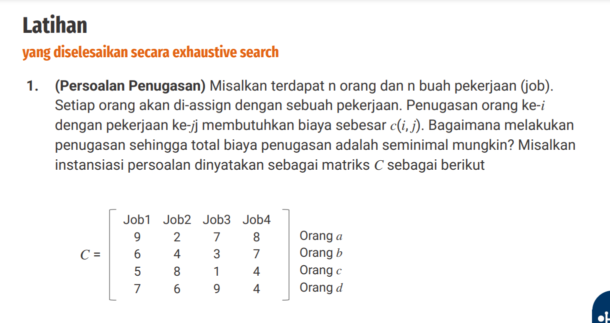
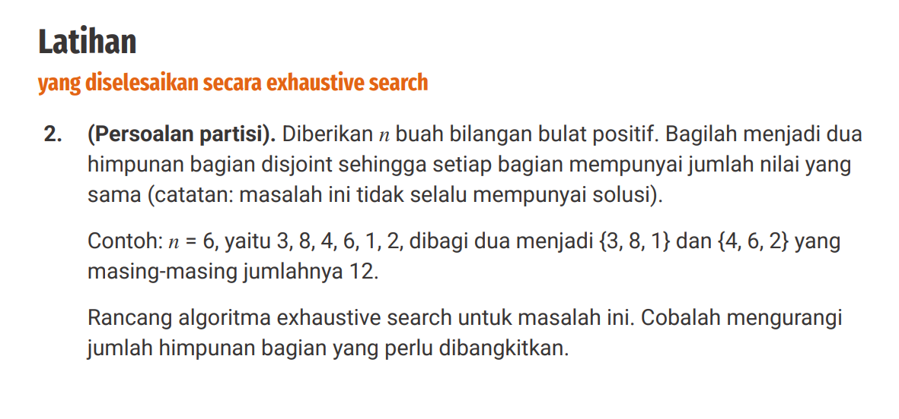
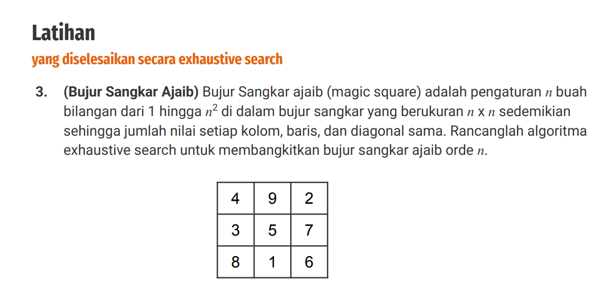

# Tugas Exhaustive Search

### Nomor 1



jawaban:

```
n = 4

C = 4!
  = 4 x 3 x 2 x 1
  = 24 
```

ada 24 kemungkinan kombinasi yang terbentuk, berikut kombinasinya yang terbentuk.


| No | Kombinasi (Orang → Job) | Perhitungan Biaya | Total Biaya |
|----|--------------------------|--------------------|------------|
| 1.  | (1, 2, 3, 4)  | 9 + 4 + 1 + 4  | **18** |
| 2.  | (1, 2, 4, 3)  | 9 + 4 + 4 + 7  | **24** |
| 3.  | (1, 3, 2, 4)  | 9 + 3 + 8 + 4  | **24** |
| 4.  | (1, 3, 4, 2)  | 9 + 3 + 4 + 6  | **22** |
| 5.  | (1, 4, 2, 3)  | 9 + 8 + 8 + 7  | **32** |
| 6.  | (1, 4, 3, 2)  | 9 + 8 + 1 + 6  | **24** |
| 7.  | (2, 1, 3, 4) -> Terkecil | 6 + 2 + 1 + 4  | **13** |
| 8.  | (2, 1, 4, 3)  | 6 + 2 + 4 + 7  | **19** |
| 9.  | (2, 3, 1, 4)  | 6 + 3 + 5 + 4  | **18** |
| 10. | (2, 3, 4, 1)  | 6 + 3 + 4 + 7  | **20** |
| 11. | (2, 4, 1, 3)  | 6 + 8 + 5 + 7  | **26** |
| 12. | (2, 4, 3, 1)  | 6 + 8 + 1 + 7  | **22** |
| 13. | (3, 1, 2, 4)  | 5 + 2 + 8 + 4  | **19** |
| 14. | (3, 1, 4, 2)  | 5 + 2 + 4 + 6  | **17** |
| 15. | (3, 2, 1, 4)  | 5 + 4 + 5 + 4  | **18** |
| 16. | (3, 2, 4, 1)  | 5 + 4 + 4 + 7  | **20** |
| 17. | (3, 4, 1, 2)  | 5 + 8 + 5 + 6  | **24** |
| 18. | (3, 4, 2, 1)  | 5 + 8 + 8 + 7  | **28** |
| 19. | (4, 1, 2, 3)  | 7 + 2 + 8 + 7  | **24** |
| 20. | (4, 1, 3, 2)  | 7 + 2 + 1 + 6  | **16** |
| 21. | (4, 2, 1, 3)  | 7 + 4 + 5 + 7  | **23** |
| 22. | (4, 2, 3, 1)  | 7 + 4 + 1 + 7  | **19** |
| 23. | (4, 3, 1, 2)  | 7 + 3 + 5 + 6  | **21** |
| 24. | (4, 3, 2, 1)  | 7 + 3 + 8 + 7  | **25** |

Dari hasil perhitungan, kombinasi dengan biaya terendah adalah (2,1,3,4) dengan total biaya 13:

(2,1,3,4) -> 6 + 2 + 1 + 4 = 13

### Nomor 2



jawaban:

```
Algorithm PartitionSubsetSum(arr, n):
    totalSum ← sum(arr)
    
    if totalSum mod 2 ≠ 0 then
        return "Tidak ada solusi"

    target ← totalSum / 2
    subset ← []
    
    if Backtrack(arr, n, 0, 0, target, subset) then
        print "Subset ditemukan:", subset
        print "Sisa elemen:", arr - subset
    else
        print "Tidak ada solusi"

Function Backtrack(arr, n, index, currentSum, target, subset):
    if currentSum = target then
        return True  
    
    if index ≥ n or currentSum > target then
        return False  
    
    subset.append(arr[index])
    if Backtrack(arr, n, index + 1, currentSum + arr[index], target, subset) then
        return True 
    
    subset.pop()
    return Backtrack(arr, n, index + 1, currentSum, target, subset)
```

### Nomor 3



jawaban:

```
Algorithm GenerateMagicSquare(n):
    numbers ← [1, 2, ..., n^2] 
    all_permutations ← GetAllPermutations(numbers) 

    for each perm in all_permutations do
        matrix ← ConvertToMatrix(perm, n)  
        
        if IsMagicSquare(matrix, n) then
            Print(matrix)   

Function GetAllPermutations(arr):
    if length(arr) == 1 then
        return [arr] 

    result ← [] 
    for each num in arr do
        remaining ← arr - {num} 
        sub_permutations ← GetAllPermutations(remaining)  
        for sub in sub_permutations do
            result.append([num] + sub) 
    return result

Function ConvertToMatrix(perm, n):
    matrix ← []
    for i from 0 to n-1 do
        row ← perm[i*n : (i+1)*n]  
        matrix.append(row)  
    return matrix

Function IsMagicSquare(matrix, n):
    target_sum ← (n * (n^2 + 1)) / 2  

    for i from 0 to n-1 do
        if sum(matrix[i]) ≠ target_sum then
            return False

    for j from 0 to n-1 do
        column_sum ← 0
        for i from 0 to n-1 do
            column_sum += matrix[i][j]
        if column_sum ≠ target_sum then
            return False

    diagonal1_sum ← sum(matrix[i][i] for i from 0 to n-1)
    if diagonal1_sum ≠ target_sum then
        return False

    diagonal2_sum ← sum(matrix[i][n-i-1] for i from 0 to n-1)
    if diagonal2_sum ≠ target_sum then
        return False

    return True  
```